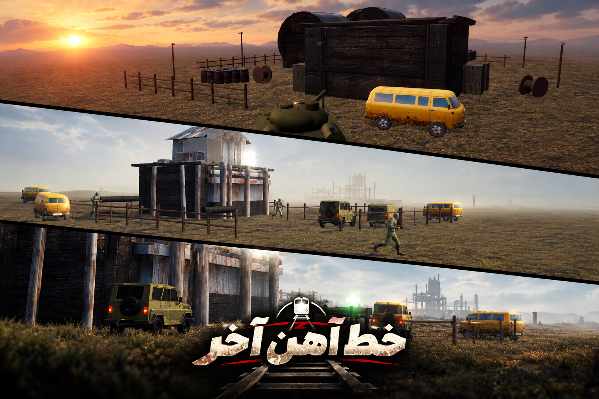

# خط آهن آخر — T-34/85

> یک بازی مرورگری سه‌بعدی، سینمایی و تاکتیکی دربارهٔ فرماندهی یک تانک T-34/85 در کارزار خیالی واردان.

  

## پوستر بازی




## آتش در سرو

در عملیات آغازین، ستون خودی را از حیاط سوختِ زیر بمباران عبور می‌دهی؛ از ریل و واگن‌ها، کانال، جادهٔ شکسته و برج دیده‌بانی می‌گذری تا راه خروج باز بماند. بازی فقط یک میدان تیر نیست: تانک، جوخه، کاروان، روایت و محیط همه در یک جریان عملیاتی به هم وصل‌اند.

## ویژگی‌ها

- نبرد سه‌بعدی با تانک T-34/85، آسیب موضعی، برخورد گلوله و تخریب‌پذیری محیط
- گلوله‌های سه‌بعدی قابل‌دیدن، جرقه، دود، شعله، نور لرزان و انفجارهای زمینی
- عملیات سینمایی قابل‌ردکردن، روایت فارسی و صحنهٔ اختصاصی «آتش در سرو»
- جوخهٔ خودی با فرمان‌های پناه، حمله، عقب‌نشینی و تجمع کنار تانک
- کنترل دقیق برجک و لوله، دوربین فرمانده، نگاه آزاد و پردهٔ دود تاکتیکی
- کیفیت گرافیک از کم تا سینمایی، تنظیم خودکار FPS، صدا، میدان دید و تمام‌صفحه
- نقشهٔ کارزار، پروفایل ذخیره، قفل‌گشایی مراحل و موسیقی آفلاین

## اجرای سریع

بازی باید با یک وب‌سرور محلی اجرا شود؛ بازکردن مستقیم `game.html` با `file://` مناسب نیست.

### ویندوز

روی [server.bat](server.bat) دوبار کلیک کن. صفحهٔ بازی در مرورگر باز می‌شود.

### لینوکس / macOS

```bash
chmod +x server.sh
./server.sh
```

پورت پیش‌فرض لینوکس `8081` است تا با سرور دیگری که روی `8080` اجرا شده تداخل نکند. برای پورت دلخواه:

```bash
./server.sh 8090
```

## کنترل‌ها

| کلید | عمل |
| --- | --- |
| `W / S / A / D` | حرکت و چرخش بدنهٔ تانک |
| `Shift + جهت‌ها` | نشانه‌گیری دقیق برجک و بالا/پایین‌بردن لوله |
| `Ctrl` | حرکت آرام و پایدار برای شلیک دقیق |
| `Alt + ماوس` | نگاه آزاد دور تانک بدون چرخاندن لوله |
| `C` | تغییر حالت دوربین |
| `Z` | علامت‌گذاری نزدیک‌ترین هدف |
| `G` | پردهٔ دود تاکتیکی |
| `F1 / F2 / F3 / F4` | پناه / حمله / عقب‌نشینی / تجمع جوخه |
| `Space` | شلیک توپ |
| `E` | تیربار |
| `1 تا 4` | انتخاب سلاح |
| `P` | توقف بازی |
| `M` | قطع/وصل صدا |

## تنظیمات عملکرد

از دکمهٔ ⚙ داخل بازی می‌توانی کیفیت، Bloom، سایه، رزولوشن داخلی، افکت‌ها، FPS، صدا، میدان دید و تمام‌صفحه را کنترل کنی. حالت خودکار هنگام افت پایدار FPS کیفیت را مرحله‌به‌مرحله پایین می‌آورد، بدون اینکه منطق بازی یا داستان حذف شود.

## ساختار پروژه

```text
game.html              نقطهٔ ورود بازی
src/
  scenes/              صحنه‌ها و دادهٔ عملیات
  entities/            تانک، کاراکتر، ناوبری و فرمان‌ها
  combat/              گلوله، برخورد، آسیب و افکت‌ها
  cinematics/          میان‌پرده‌های قابل‌ردکردن
  ui/                  HUD، تنظیمات، پروفایل و نقشهٔ کارزار
assets/                مدل‌ها، بافت‌ها و موسیقی
tests/                 تست‌های رفتاری و رگرسیون
```

## توسعه

تست‌های Node را از ریشهٔ پروژه اجرا کن:

```powershell
Get-ChildItem tests -Filter *.mjs | ForEach-Object { node $_.FullName }
```

## مجوز و دارایی‌ها

پیش از انتشار عمومی یا تجاری، مجوز تمام دارایی‌های بیرونی را بررسی کن. کد، مدل‌ها، بافت‌ها و موسیقی ممکن است مجوزهای متفاوت داشته باشند.

---

ساخته‌شده برای یک کارزار زرهی واقع‌گرایانه، تلخ و قهرمانانه.
